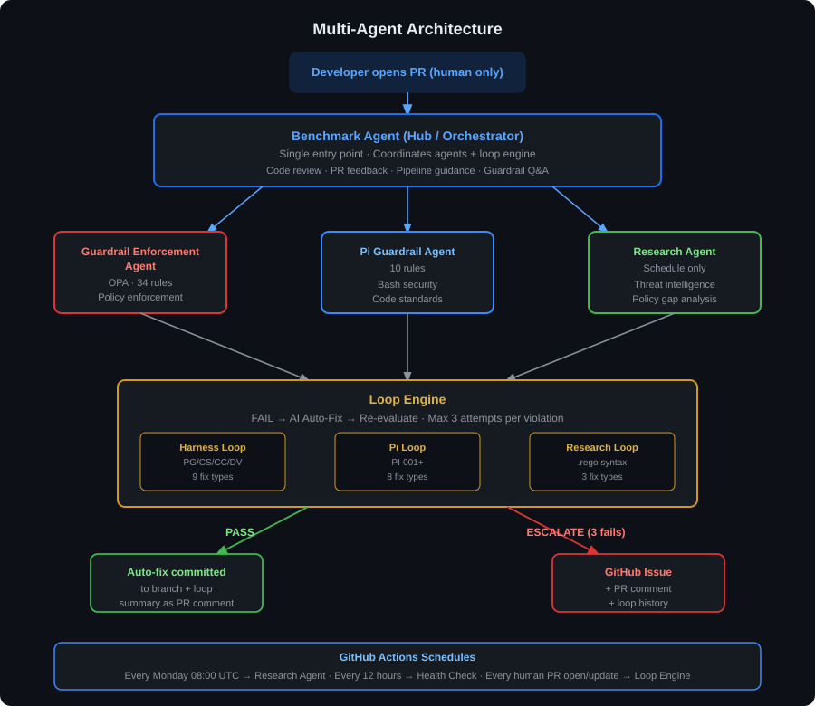
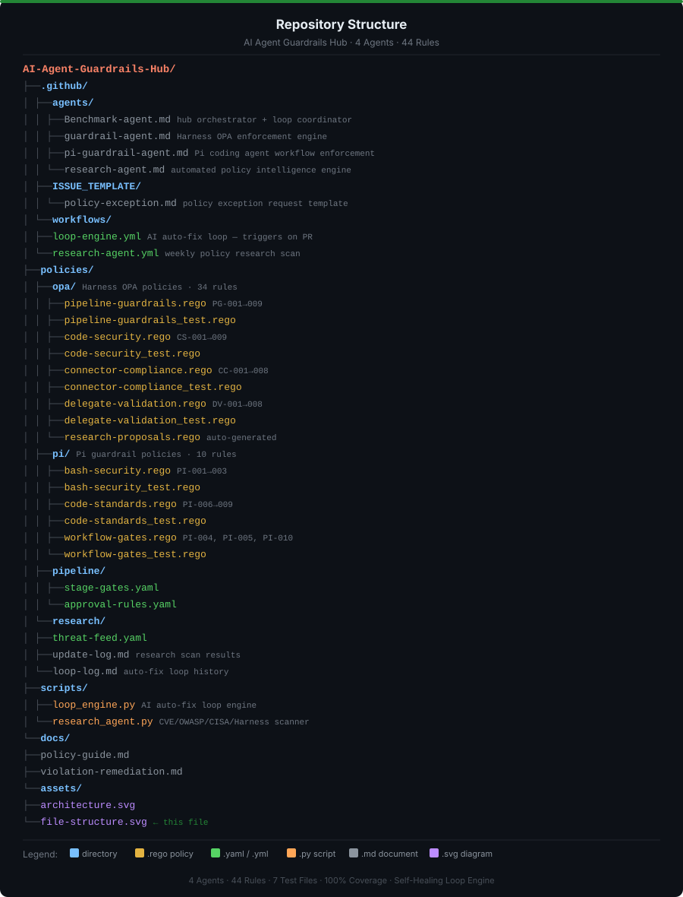

# agent_guardrails
🛡️ Self-Healing Multi-Agent Guardrail Hub


---

## ✅ System Status

| Component | Status | Details |
|---|---|---|
| Benchmark Agent | ✅ Active & Verified | Hub orchestrator + loop coordinator |
| Guardrail Enforcement Agent | ✅ Active & Verified | 34 Harness OPA rules — PR #41 confirmed |
| Pi Guardrail Agent | ✅ Active & Verified | 10 Pi workflow rules — PR #41 confirmed |
| Research Agent | ✅ Active & Verified | Weekly CVE scan — Issue #62 auto-created |
| Harness OPA Loop | ✅ Active & Verified | Re-evals fixed YAML — PR #53 confirmed |
| Pi Workflow Loop | ✅ Active & Verified | Auto-fixes PI violations — PR #53 confirmed |
| Research Loop | ✅ Active & Verified | .rego syntax fixes — PR #53 confirmed |
| Health Check | ✅ Active | Every 12 hours — posts to Actions Summary |
| Escalation Engine | ✅ Active & Verified | GitHub Issues auto-created — confirmed |
| 7 test files | ✅ Passing | 44 rules covered — 100% coverage |
| loop-engine.yml | ✅ Active & Verified | Sequential jobs — no conflicts |
| research-agent.yml | ✅ Active & Verified | Monday 08:00 UTC — Issue not PR (GHE) |
| health-check.yml | ✅ Active | Every 12 hours |
| loop_engine.py | ✅ Active & Verified | Re-evals fixed YAML — OPA_PATH fixed |
| research_agent.py | ✅ Active & Verified | --force-scan — real CVE data |


---

## 🤖 Multi-Agent Architecture



### Agents

| Agent | Role | Trigger |
|---|---|---|
| **Benchmark Agent** | Hub & orchestrator — single entry point for all developer interactions | Every PR / question |
| **Guardrail Enforcement Agent** | OPA policy evaluation — 34 Harness rules across pipelines, connectors, delegates, code | Called by Benchmark Agent |
| **Pi Guardrail Agent** | 10 Pi workflow rules — bash security levels, code standards, workflow gates | Called by Benchmark Agent |
| **Research Agent** | Weekly threat intelligence scan — NVD CVE, CISA KEV, OWASP; drafts new policy skeletons | Monday 08:00 UTC (schedule) |

### Flow

```
Developer opens PR (human only)
        │
        ▼
┌─────────────────────────────┐
│      Benchmark Agent        │  ← Hub / orchestrator
│  Code review · Q&A · triage │
└──────┬──────────┬───────────┘
       │          │
       ▼          ▼
 Guardrail     Pi Guardrail
 Enforcement   Agent
 Agent         (10 rules)
 (34 rules)
       │          │
       └────┬─────┘
            ▼
    ┌───────────────────────────────────┐
    │           Loop Engine             │
    │  FAIL → AI auto-fix → re-evaluate │
    │  Max 3 attempts per violation     │
    ├──────────────┬────────────────────┤
    │ Harness Loop │ Pi Loop │ Research │
    │  (9 fixes)   │(8 fixes)│ Loop (3) │
    └──────┬───────┴─────────┴────┬─────┘
           │                      │
      ✅ PASS                 ❌ ESCALATE
           │                      │
    Auto-fix committed       GitHub Issue
    to branch + PR comment   + PR comment
                             + loop history
```

### Loop Engine — Severity Routing

| Severity | Action |
|---|---|
| 🔴 CRITICAL / 🟠 HIGH | Auto-fix loop — up to 3 attempts |
| 🟡 MEDIUM | 1 attempt — then advise developer |
| 🟢 LOW | Advise only — no loop |

### Schedules

| Trigger | Workflow |
|---|---|
| Every human PR open/update | Loop Engine — auto-fix pipeline |
| Monday 08:00 UTC | Research Agent — policy intelligence scan |
| Every 12 hours | Health Check — posts to Actions Summary |

> Loop Engine triggers on **human PRs only** (bot actors excluded).
> Zero approval required in GitHub Enterprise Cloud.

---

## ⚡ Quick Start

### Step 1 — Clone
```bash
git clone https://github.com/Deloitte-Global-Cloud-Services/agent_guardrails.git
cd agent_guardrails
```

### Step 2 — Open a PR
Create any branch with a change and open a PR against main.
The Loop Engine triggers automatically.

### Step 3 — Watch It Run
Go to: Actions tab → **Loop Engine — Auto-Fix Pipeline**
Watch all 3 jobs run automatically.

### Step 4 — Check PR Comment
Go back to your PR → Conversation tab.
Loop Engine posts a summary comment showing compliance report + fixes applied.

No configuration needed. No approval required. The system is self-healing from first use.

---

## ✅ Verified Results

All components confirmed working in production — GitHub Enterprise Cloud.

### Loop Engine — PR #41 · PR #53

| Pipeline | Result | Date |
|---|---|---|
| Harness OPA Loop | ✅ PASS | 2026-06-15 |
| Pi Workflow Loop | ✅ PASS | 2026-06-15 |
| Research Loop | ✅ PASS | 2026-06-15 |
| Auto-fix re-evals fixed YAML | ✅ CONFIRMED | 2026-06-16 |
| Sequential jobs — no git conflicts | ✅ CONFIRMED | 2026-06-16 |
| Zero approval required | ✅ CONFIRMED | 2026-06-15 |

Loop Engine Summary from PR #53:
Status: ✅ ALL LOOPS PASSED
Date: Tue Jun 16 00:51 UTC 2026

### Research Agent — Run #24

| Check | Result | Detail |
|---|---|---|
| API connections | ✅ PASS | NVD + CISA reachable |
| Branch auto-created | ✅ PASS | research/auto-2026-06-16-* |
| Scan data committed | ✅ PASS | 75 lines inserted |
| GitHub Issue created | ✅ PASS | Issue #62 auto-created |
| Labels applied | ✅ PASS | research-proposal + needs-human-review |
| Baseline established | ✅ PASS | 44 rules documented |

> **Note:** Research Agent creates GitHub Issues instead of PRs — GitHub Enterprise Cloud policy prevents Actions from opening PRs. Human opens PR manually after review.

### Escalation Engine

| Check | Result | Detail |
|---|---|---|
| Loop escalation issues | ✅ CONFIRMED | Issues #39-#43 auto-created |
| Research scan issues | ✅ CONFIRMED | Issues #60 #62 auto-created |
| Labels on issues | ✅ CONFIRMED | All 5 labels working |
| Issue content | ✅ CONFIRMED | Branch link + scan summary |

---

## 🔁 How The Loop Works

| Step | What Happens |
|---|---|
| Human opens PR | Loop Engine triggers automatically |
| OPA evaluates | Checks all files against 44 rules |
| PASS | Summary comment posted — done |
| FAIL | AI auto-fix applied to PR branch |
| Re-evaluate | Up to 3 attempts |
| Still failing | GitHub Issue created + PR comment |
| Always | Loop history logged to loop-log.md |

**Harness fixes (9):** PG-001 approval gate, PG-002 secret refs, PG-003 registry, PG-004 timeout, PG-005 delegate selector, PG-006 wildcard, PG-007 rollback, PG-008 description, PG-009 tags

**Pi fixes (8):** PI-001/002 bash level→L4, PI-003 blocked commands, PI-004 pytest step, PI-005 approval flag, PI-006 autopep8, PI-007 env var, PI-008 test stub

**Research fixes (3):** .rego syntax, duplicate rule ID, missing package header

**Severity:** CRITICAL/HIGH → 3 attempts | MEDIUM → 1 attempt | LOW → advise only

**Escalation:** GitHub Issue + PR comment · Labels: `loop-engine-escalation`

---

## 📅 GitHub Actions Schedule

| Workflow | Trigger | Notes |
|---|---|---|
| Loop Engine | Every human PR | Skips bot actors |
| Research Agent | Monday 08:00 UTC | Schedule only |
| Health Check | Every 12 hours | Posts to Actions Summary |

---

## 📋 Policy Reference — All 44 Rules

Run locally: `opa test policies/opa/` · `opa test policies/pi/`

### Harness OPA Policies (34 rules)

#### `pipeline-guardrails.rego` — Package `harness.pipeline.guardrails`

| Rule | Severity | Summary |
|---|---|---|
| PG-001 | 🔴 CRITICAL | Approval gate required before production deploy |
| PG-002 | 🔴 CRITICAL | No plaintext secrets in pipeline YAML |
| PG-003 | 🟠 HIGH | Container images must use approved registries |
| PG-004 | 🟡 MEDIUM | Pipeline stage timeout must be set |
| PG-005 | 🟡 MEDIUM | Delegate selector must be specified for deploy stages |
| PG-006 | 🟠 HIGH | No wildcard delegate selector |
| PG-007 | 🟠 HIGH | Rollback strategy required for production deployments |
| PG-008 | 🟢 LOW | Pipeline must have a description |
| PG-009 | 🟢 LOW | Required pipeline tags must be present (`owner`, `cost-centre`) |

#### `code-security.rego` — Package `harness.code.security`

| Rule | Severity | Summary |
|---|---|---|
| CS-001 | 🔴 CRITICAL | No hardcoded API keys or tokens in code |
| CS-002 | 🔴 CRITICAL | No hardcoded passwords or credentials |
| CS-003 | 🟠 HIGH | No use of deprecated or insecure functions (MD5, eval, exec, etc.) |
| CS-004 | 🟠 HIGH | No direct commits to main/master branch |
| CS-005 | 🟠 HIGH | Branch protection rules must be enabled |
| CS-006 | 🟡 MEDIUM | Code must pass SAST scan before merge |
| CS-007 | 🟡 MEDIUM | No sensitive data in environment variables |
| CS-008 | 🟢 LOW | Code files must have license headers |
| CS-009 | 🟢 LOW | No debug or test code left in production files |

#### `connector-compliance.rego` — Package `harness.connector.compliance`

| Rule | Severity | Summary |
|---|---|---|
| CC-001 | 🔴 CRITICAL | All connectors must use secret references |
| CC-002 | 🔴 CRITICAL | No expired connector credentials allowed |
| CC-003 | 🟠 HIGH | Connectors must use approved authentication types |
| CC-004 | 🟠 HIGH | Git connectors must use SSH or token auth only |
| CC-005 | 🟠 HIGH | Cloud connectors must use IAM roles not keys |
| CC-006 | 🟡 MEDIUM | Connectors must have owner and team tags |
| CC-007 | 🟡 MEDIUM | Connector names must follow naming convention |
| CC-008 | 🟢 LOW | Connectors must have a description field |

#### `delegate-validation.rego` — Package `harness.delegate.validation`

| Rule | Severity | Summary |
|---|---|---|
| DV-001 | 🔴 CRITICAL | Delegates must be active and connected |
| DV-002 | 🔴 CRITICAL | Delegates must run approved versions only |
| DV-003 | 🟠 HIGH | Delegates must carry org-approved tag |
| DV-004 | 🟠 HIGH | Delegates must not run as root user |
| DV-005 | 🟠 HIGH | Delegate must have resource limits defined |
| DV-006 | 🟡 MEDIUM | Delegates must be assigned to correct scope |
| DV-007 | 🟡 MEDIUM | Delegate names must follow naming convention |
| DV-008 | 🟢 LOW | Delegates must have owner and cost-centre tags |

### Pi Guardrail Policies (10 rules)

#### `bash-security.rego` — Package `pi.guardrails.bash`

| Rule | Severity | Summary |
|---|---|---|
| PI-001 | 🔴 CRITICAL | Pi agent bash security level must be L4 or L5 minimum |
| PI-002 | 🔴 CRITICAL | No unrestricted bash tool access (L1/L2/L3) |
| PI-003 | 🟠 HIGH | Bash commands must match approved whitelist only |

#### `workflow-gates.rego` — Package `pi.guardrails.workflow`

| Rule | Severity | Summary |
|---|---|---|
| PI-004 | 🟠 HIGH | Tests must pass (exit code 0) before PR can be opened |
| PI-005 | 🟠 HIGH | Human approval gate must be completed before PR is opened |
| PI-010 | 🟢 LOW | All Pi agent workflow steps must be logged with timestamp, action, outcome |

#### `code-standards.rego` — Package `pi.guardrails.code`

| Rule | Severity | Summary |
|---|---|---|
| PI-006 | 🟡 MEDIUM | Pi-generated code must pass linting (no syntax errors, PEP8) |
| PI-007 | 🟡 MEDIUM | No hardcoded secrets, API keys, passwords, or tokens |
| PI-008 | 🟡 MEDIUM | Pi-generated code must include at minimum one unit test per function |
| PI-009 | 🟡 MEDIUM | Approved Pi agent versions only |

---

## 🔐 Bash Security Levels

| Level | Name | Required Level | Status |
|---|---|---|---|
| L5 | No Bash Tool | ✅ Compliant | Most secure |
| L4 | Bash + Whitelist | ✅ Compliant | Minimum required |
| L3 | Bash + Blacklist | ❌ VIOLATION | Loop auto-fixes to L4 |
| L2 | System Prompt | ❌ VIOLATION | Loop auto-fixes to L4 |
| L1 | User Prompt | ❌ VIOLATION | Loop auto-fixes to L4 |

---

## 🔬 Research Agent

**Monitors:** NVD CVE (weekly) · OWASP Top 10 (monthly) · CISA KEV (weekly) · Harness Releases (weekly)

#### How It Works

1. GitHub Actions triggers Monday 08:00 UTC
2. `scripts/research_agent.py` runs
3. Tests API connections (NVD + CISA)
4. Fetches CVEs with 30-day lookback
5. Compares against all 44 existing rules
6. Identifies gaps — threats with no coverage
7. Drafts new `.rego` rule skeletons
8. Commits proposals to `research/auto-*` branch
9. Creates GitHub Issue with scan summary
10. Human reviews Issue + opens PR manually
11. Loop Engine validates PR automatically

> **GitHub Enterprise Cloud Note:**
> GitHub Actions cannot create PRs in GHE.
> Research Agent creates a GitHub Issue instead.
> Human opens the PR manually after review.

#### Manual Trigger
Actions → **Research Agent — Policy Intelligence Scan** → Run workflow
Use `force_failure: true` to test escalation.

#### GitHub Enterprise Cloud Compatibility

This system is designed for GitHub Enterprise Cloud where org-level policies restrict certain Actions capabilities.

| Restriction | Our Solution |
|---|---|
| Bot PRs require approval | Loop Engine triggers on human PRs only |
| Actions cannot create PRs | Research Agent creates Issues instead |
| Workflow permissions managed by org | All workflows use GITHUB_TOKEN with minimal required permissions |

Bot actors excluded from Loop Engine:
- `github-actions[bot]`
- `copilot-swe-agent[bot]`
- `dependabot[bot]`

---

## 🏗️ Repository Structure



---

## 📐 Input Schema Reference

### Harness Pipeline — Compliant YAML

```yaml
pipeline:
  name: my-compliant-pipeline
  description: "Main production deployment pipeline"
  tags:
    owner: platform-team
    cost-centre: CC-1234
  stages:
    - name: deploy-prod
      type: Deployment
      timeout: 2h                          # Required: PG-004
      spec:
        environment:
          type: Production
        infrastructure:
          spec:
            delegateSelectors:
              - prod-eu-west-delegate      # Required: PG-005, not wildcard: PG-006
        execution:
          steps:
            - step:
                name: approve
                type: HarnessApproval      # Required: PG-001
                spec: {}
            - step:
                name: deploy
                type: K8sRollingDeploy
                spec:
                  image: gcr.io/deloitte-platform/my-service:1.0.0  # Approved registry: PG-003
          rollbackSteps:
            - step:
                name: rollback
                type: K8sRollingRollback   # Required: PG-007
                spec: {}
```

**Status: PASS** — all 9 PG rules satisfied.

### Harness Delegate — Compliant YAML

```json
{
  "delegates": [
    {
      "name": "prod-eu-west-delegate-01",
      "status": "ENABLED",
      "connected": true,
      "version": "24.01.81202",
      "tags": ["org-approved", "owner:platform-team", "cost-centre:CC-001"],
      "security_context": { "run_as_user": 1000, "privileged": false },
      "spec": { "runAsRoot": false },
      "resources": { "limits": { "cpu": "1", "memory": "2Gi" } },
      "scope": { "type": "PROJECT", "project_identifier": "my-project" }
    }
  ],
  "policy": {
    "approved_delegate_versions": ["24.01.81202", "23.12.80308"]
  }
}
```

> **Note:** The `policy` block must be at the **root level** of the input object (not nested inside `delegates`). This is required for DV-002 to correctly resolve approved delegate versions.

**Status: PASS** — all 8 DV rules satisfied.

### Pi Agent — Compliant YAML

```json
{
  "pi_agent": {
    "version": "2.1.0",
    "bash_security_level": "L4",           // Required: PI-001, PI-002
    "human_approval_completed": true,      // Required: PI-005
    "bash_commands": ["pytest", "git add .", "git commit -m 'fix'", "gh pr create"],
    "workflow_steps": [
      { "action": "pytest", "outcome": "pass", "tests_passed": true, "timestamp": "2026-06-08T10:00:00Z" },
      { "action": "gh pr create", "outcome": "pass", "timestamp": "2026-06-08T10:01:00Z" }
    ]
  },
  "files": [
    {
      "path": "app.py",
      "content": "def hello():\n    return 'world'",
      "lint_status": "pass",              // Required: PI-006
      "lint_errors": [],
      "functions": [{ "name": "hello" }],
      "tests": [{ "name": "test_hello" }] // Required: PI-008
    }
  ],
  "policy": {
    "approved_pi_versions": ["2.1.0", "2.0.0"]  // Required at root level: PI-009
  }
}
```

> **Notes:**
> - `lint_status` must be `"pass"` (not `lint_passed`) — evaluated per file in the `files` array
> - `policy.approved_pi_versions` must be at **root level** of the input object
> - `bash_security_level` must be `"L4"` or `"L5"` to pass PI-001 and PI-002
> - `human_approval_completed: true` must be at the root `pi_agent` level

**Status: PASS** — all 10 PI rules satisfied.

---

## 🚀 Getting Started

**Prerequisites:** GitHub Copilot Enterprise · Harness Policy Engine · GitHub Actions · OPA CLI

| Use Case | Steps |
|---|---|
| Harness enforcement | Clone → deploy agents → load .rego to Harness → open PR |
| Pi enforcement | Load policies/pi/ → ensure Pi emits schema → open PR |
| Loop Engine | Merge loop-engine.yml → open human PR → watch Actions |
| Research Agent | Merge research-agent.yml → wait Monday or run manually |

---

## 🧪 Testing Guide

| Test | Input | Expected |
|---|---|---|
| Harness FAIL | Pipeline with violations | FAIL + loop activates + auto-fix |
| Harness PASS | Canonical compliant pipeline | PASS immediately |
| Pi FAIL | bash_security_level: L2 | FAIL + loop activates |
| Pi PASS | Canonical compliant Pi config | PASS immediately |
| Research scan | Manual workflow trigger | Scan + PR if gaps |
| Loop escalation | Unfixable violation | 3 attempts + GitHub Issue |

```bash
# Test all Harness OPA policies
opa test policies/opa/ -v

# Test all Pi guardrail policies
opa test policies/pi/ -v
```

Expected: **All tests pass** — 7 test files, 44 rules covered.

**Canonical compliant pipeline (all 9 PG rules passing):**
```yaml
pipeline:
  name: my-compliant-pipeline
  description: "Main production deployment pipeline"
  tags:
    owner: platform-team
    cost-centre: CC-1234
  stages:
    - name: deploy-prod
      type: Deployment
      timeout: 2h
      spec:
        environment:
          type: Production
        infrastructure:
          spec:
            delegateSelectors:
              - prod-eu-west-delegate
        execution:
          steps:
            - step:
                name: approve
                type: HarnessApproval
                spec: {}
            - step:
                name: deploy
                type: K8sRollingDeploy
                spec:
                  image: gcr.io/deloitte-platform/my-service:1.0.0
          rollbackSteps:
            - step:
                name: rollback
                type: K8sRollingRollback
                spec: {}
```

---

## ❓ FAQ

**Q: Do I need to approve the Loop Engine every time it runs?**
A: No. The Loop Engine only triggers on human-opened PRs. Since you opened the PR, GitHub already trusts the workflow run. Zero approval required.

**Q: What happens if the Loop Engine cannot fix a violation?**
A: After 3 failed attempts the Loop Engine creates a GitHub Issue with label `loop-engine-escalation` and posts a comment on the PR with the full loop history. You then fix it manually.

**Q: How do I know if my pipeline is compliant before opening a PR?**
A: Run OPA locally:
```bash
opa eval \
  -d policies/opa/pipeline-guardrails.rego \
  -i your-pipeline.json \
  "data.harness.pipeline.guardrails.violation"
```
An empty result means compliant.

**Q: How do I add a new OPA rule?**
A: Follow the Contributing guide. Branch `policy/your-rule-name`, add the `.rego` file and a matching `_test.rego`, then open a PR.

**Q: Why does Research Agent create an Issue instead of a PR?**
A: GitHub Enterprise Cloud org policy prevents GitHub Actions from creating PRs directly. The Research Agent creates a GitHub Issue with scan results and branch link instead. You open the PR manually after reviewing.

**Q: Why did the Research Agent scan show 0 items?**
A: First run establishes a baseline only. PR #63 fixes this — subsequent runs perform a full scan with 30-day lookback. You can also trigger `--force-scan` manually.

**Q: How do I open the research PR manually?**
A: Go to the Issue created by Research Agent. Click the branch link in the issue body. GitHub shows a **Compare & pull request** button. Click it and open the PR normally.

**Q: What happens when I assign an Issue to Copilot?**
A: Copilot reads the issue, creates a fix PR, the Loop Engine validates it automatically, you review and merge. This is the intended workflow for all agent_guardrails issues.

---

## 🔧 Troubleshooting

| Problem | Likely Cause | Fix |
|---|---|---|
| Loop not triggering | Bot opened PR | Open as human |
| action_required | GHE org policy | Only human PRs trigger |
| OPA not found | Path issue | Check OPA_PATH env var |
| Tests failing | Schema mismatch | Run opa test locally |
| Research not running | Not on main | Merge research-agent.yml |
| API rate limit | NVD limit | Add NIST_API_KEY secret |
| Loop escalating always | Fix not working | Check loop_engine.py logic |
| Health check failing | File missing | Restore from git history |
| Research Agent creates Issue not PR | GHE policy — Actions cannot create PRs | Expected behaviour — open PR manually |
| Research scan shows 0 items | First run — baseline only mode | Wait for PR #63 fix or trigger --force-scan |
| Loop Engine jobs skipped | PR is in Draft status | Convert to Ready for review |
| Git push rejected | Parallel jobs conflict | Fixed in PR #44 — sequential jobs |
| Label not found error | Labels not created yet | Fixed in PR #54 — auto-created on run |

---

## 📬 Contributing

**Branch naming:**
`policy/` · `fix/` · `docs/` · `feat/` · `test/`
(`research/` and `loop/` are auto-created)

**Add a new rule:**
1. Branch `policy/your-rule-name`
2. Add `.rego` + matching `_test.rego`
3. Update `violation-remediation.md`
4. Open PR — Loop Engine validates automatically

**Policy exception:** Use `.github/ISSUE_TEMPLATE/policy-exception.md`

---

## 🔧 Maintenance

See [docs/MAINTENANCE.md](docs/MAINTENANCE.md)
for the weekly/monthly/quarterly maintenance
runbook, troubleshooting reference, and
escalation guide.

